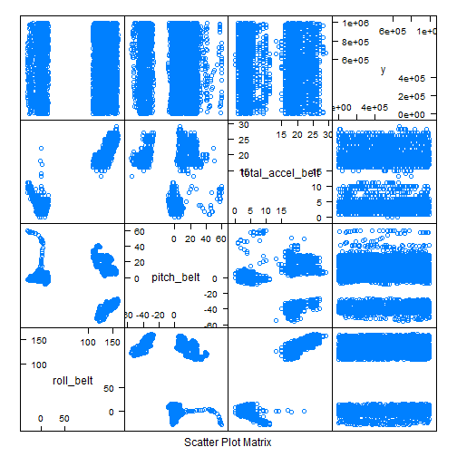
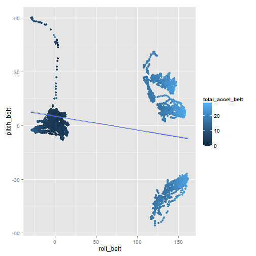

Practical Machine Learning Assignment
========================================================

This is an R Markdown document describing the procedure useed in prediction for the assignment for the Practical Machine Learning Course. The following sections therefore present how the analysis is caried.

To start the analysis, the caret package is loaded in;

```r
library(caret)
```

```
## Loading required package: lattice
## Loading required package: ggplot2
```

To load in the datasets, i.e. the traning and testing datasets;

```r
training <- read.csv("C:/Users/Zilon/Downloads/pml-training.csv")
summary(training)
```

```
##        X            user_name    raw_timestamp_part_1 raw_timestamp_part_2
##  Min.   :    1   adelmo  :3892   Min.   :1.32e+09     Min.   :   294      
##  1st Qu.: 4906   carlitos:3112   1st Qu.:1.32e+09     1st Qu.:252912      
##  Median : 9812   charles :3536   Median :1.32e+09     Median :496380      
##  Mean   : 9812   eurico  :3070   Mean   :1.32e+09     Mean   :500656      
##  3rd Qu.:14717   jeremy  :3402   3rd Qu.:1.32e+09     3rd Qu.:751891      
##  Max.   :19622   pedro   :2610   Max.   :1.32e+09     Max.   :998801      
##                                                                           
##           cvtd_timestamp  new_window    num_window    roll_belt    
##  28/11/2011 14:14: 1498   no :19216   Min.   :  1   Min.   :-28.9  
##  05/12/2011 11:24: 1497   yes:  406   1st Qu.:222   1st Qu.:  1.1  
##  30/11/2011 17:11: 1440               Median :424   Median :113.0  
##  05/12/2011 11:25: 1425               Mean   :431   Mean   : 64.4  
##  02/12/2011 14:57: 1380               3rd Qu.:644   3rd Qu.:123.0  
##  02/12/2011 13:34: 1375               Max.   :864   Max.   :162.0  
##  (Other)         :11007                                            
##    pitch_belt        yaw_belt      total_accel_belt kurtosis_roll_belt
##  Min.   :-55.80   Min.   :-180.0   Min.   : 0.0              :19216   
##  1st Qu.:  1.76   1st Qu.: -88.3   1st Qu.: 3.0     #DIV/0!  :   10   
##  Median :  5.28   Median : -13.0   Median :17.0     -1.908453:    2   
##  Mean   :  0.31   Mean   : -11.2   Mean   :11.3     -0.016850:    1   
##  3rd Qu.: 14.90   3rd Qu.:  12.9   3rd Qu.:18.0     -0.021024:    1   
##  Max.   : 60.30   Max.   : 179.0   Max.   :29.0     -0.025513:    1   
##                                                     (Other)  :  391   
##  kurtosis_picth_belt kurtosis_yaw_belt skewness_roll_belt
##           :19216            :19216              :19216   
##  #DIV/0!  :   32     #DIV/0!:  406     #DIV/0!  :    9   
##  47.000000:    4                       0.000000 :    4   
##  -0.150950:    3                       0.422463 :    2   
##  -0.684748:    3                       -0.003095:    1   
##  -1.750749:    3                       -0.010002:    1   
##  (Other)  :  361                       (Other)  :  389   
##  skewness_roll_belt.1 skewness_yaw_belt max_roll_belt   max_picth_belt 
##           :19216             :19216     Min.   :-94     Min.   : 3     
##  #DIV/0!  :   32      #DIV/0!:  406     1st Qu.:-88     1st Qu.: 5     
##  0.000000 :    4                        Median : -5     Median :18     
##  -2.156553:    3                        Mean   : -7     Mean   :13     
##  -3.072669:    3                        3rd Qu.: 18     3rd Qu.:19     
##  -6.324555:    3                        Max.   :180     Max.   :30     
##  (Other)  :  361                        NA's   :19216   NA's   :19216  
##   max_yaw_belt   min_roll_belt   min_pitch_belt   min_yaw_belt  
##         :19216   Min.   :-180    Min.   : 0             :19216  
##  -1.1   :   30   1st Qu.: -88    1st Qu.: 3      -1.1   :   30  
##  -1.4   :   29   Median :  -8    Median :16      -1.4   :   29  
##  -1.2   :   26   Mean   : -10    Mean   :11      -1.2   :   26  
##  -0.9   :   24   3rd Qu.:   9    3rd Qu.:17      -0.9   :   24  
##  -1.3   :   22   Max.   : 173    Max.   :23      -1.3   :   22  
##  (Other):  275   NA's   :19216   NA's   :19216   (Other):  275  
##  amplitude_roll_belt amplitude_pitch_belt amplitude_yaw_belt
##  Min.   :  0         Min.   : 0                  :19216     
##  1st Qu.:  0         1st Qu.: 1           #DIV/0!:   10     
##  Median :  1         Median : 1           0.00   :   12     
##  Mean   :  4         Mean   : 2           0.0000 :  384     
##  3rd Qu.:  2         3rd Qu.: 2                             
##  Max.   :360         Max.   :12                             
##  NA's   :19216       NA's   :19216                          
##  var_total_accel_belt avg_roll_belt   stddev_roll_belt var_roll_belt  
##  Min.   : 0           Min.   :-27     Min.   : 0       Min.   :  0    
##  1st Qu.: 0           1st Qu.:  1     1st Qu.: 0       1st Qu.:  0    
##  Median : 0           Median :116     Median : 0       Median :  0    
##  Mean   : 1           Mean   : 68     Mean   : 1       Mean   :  8    
##  3rd Qu.: 0           3rd Qu.:123     3rd Qu.: 1       3rd Qu.:  0    
##  Max.   :16           Max.   :157     Max.   :14       Max.   :201    
##  NA's   :19216        NA's   :19216   NA's   :19216    NA's   :19216  
##  avg_pitch_belt  stddev_pitch_belt var_pitch_belt   avg_yaw_belt  
##  Min.   :-51     Min.   :0         Min.   : 0      Min.   :-138   
##  1st Qu.:  2     1st Qu.:0         1st Qu.: 0      1st Qu.: -88   
##  Median :  5     Median :0         Median : 0      Median :  -7   
##  Mean   :  1     Mean   :1         Mean   : 1      Mean   :  -9   
##  3rd Qu.: 16     3rd Qu.:1         3rd Qu.: 0      3rd Qu.:  14   
##  Max.   : 60     Max.   :4         Max.   :16      Max.   : 174   
##  NA's   :19216   NA's   :19216     NA's   :19216   NA's   :19216  
##  stddev_yaw_belt  var_yaw_belt    gyros_belt_x      gyros_belt_y    
##  Min.   :  0     Min.   :    0   Min.   :-1.0400   Min.   :-0.6400  
##  1st Qu.:  0     1st Qu.:    0   1st Qu.:-0.0300   1st Qu.: 0.0000  
##  Median :  0     Median :    0   Median : 0.0300   Median : 0.0200  
##  Mean   :  1     Mean   :  107   Mean   :-0.0056   Mean   : 0.0396  
##  3rd Qu.:  1     3rd Qu.:    0   3rd Qu.: 0.1100   3rd Qu.: 0.1100  
##  Max.   :177     Max.   :31183   Max.   : 2.2200   Max.   : 0.6400  
##  NA's   :19216   NA's   :19216                                      
##   gyros_belt_z     accel_belt_x      accel_belt_y    accel_belt_z   
##  Min.   :-1.460   Min.   :-120.00   Min.   :-69.0   Min.   :-275.0  
##  1st Qu.:-0.200   1st Qu.: -21.00   1st Qu.:  3.0   1st Qu.:-162.0  
##  Median :-0.100   Median : -15.00   Median : 35.0   Median :-152.0  
##  Mean   :-0.130   Mean   :  -5.59   Mean   : 30.1   Mean   : -72.6  
##  3rd Qu.:-0.020   3rd Qu.:  -5.00   3rd Qu.: 61.0   3rd Qu.:  27.0  
##  Max.   : 1.620   Max.   :  85.00   Max.   :164.0   Max.   : 105.0  
##                                                                     
##  magnet_belt_x   magnet_belt_y magnet_belt_z     roll_arm     
##  Min.   :-52.0   Min.   :354   Min.   :-623   Min.   :-180.0  
##  1st Qu.:  9.0   1st Qu.:581   1st Qu.:-375   1st Qu.: -31.8  
##  Median : 35.0   Median :601   Median :-320   Median :   0.0  
##  Mean   : 55.6   Mean   :594   Mean   :-346   Mean   :  17.8  
##  3rd Qu.: 59.0   3rd Qu.:610   3rd Qu.:-306   3rd Qu.:  77.3  
##  Max.   :485.0   Max.   :673   Max.   : 293   Max.   : 180.0  
##                                                               
##    pitch_arm         yaw_arm        total_accel_arm var_accel_arm  
##  Min.   :-88.80   Min.   :-180.00   Min.   : 1.0    Min.   :  0    
##  1st Qu.:-25.90   1st Qu.: -43.10   1st Qu.:17.0    1st Qu.:  9    
##  Median :  0.00   Median :   0.00   Median :27.0    Median : 41    
##  Mean   : -4.61   Mean   :  -0.62   Mean   :25.5    Mean   : 53    
##  3rd Qu.: 11.20   3rd Qu.:  45.88   3rd Qu.:33.0    3rd Qu.: 76    
##  Max.   : 88.50   Max.   : 180.00   Max.   :66.0    Max.   :332    
##                                                     NA's   :19216  
##   avg_roll_arm   stddev_roll_arm  var_roll_arm   avg_pitch_arm  
##  Min.   :-167    Min.   :  0     Min.   :    0   Min.   :-82    
##  1st Qu.: -38    1st Qu.:  1     1st Qu.:    2   1st Qu.:-23    
##  Median :   0    Median :  6     Median :   33   Median :  0    
##  Mean   :  13    Mean   : 11     Mean   :  417   Mean   : -5    
##  3rd Qu.:  76    3rd Qu.: 15     3rd Qu.:  223   3rd Qu.:  8    
##  Max.   : 163    Max.   :162     Max.   :26232   Max.   : 76    
##  NA's   :19216   NA's   :19216   NA's   :19216   NA's   :19216  
##  stddev_pitch_arm var_pitch_arm    avg_yaw_arm    stddev_yaw_arm 
##  Min.   : 0       Min.   :   0    Min.   :-173    Min.   :  0    
##  1st Qu.: 2       1st Qu.:   3    1st Qu.: -29    1st Qu.:  3    
##  Median : 8       Median :  66    Median :   0    Median : 17    
##  Mean   :10       Mean   : 196    Mean   :   2    Mean   : 22    
##  3rd Qu.:16       3rd Qu.: 267    3rd Qu.:  38    3rd Qu.: 36    
##  Max.   :43       Max.   :1885    Max.   : 152    Max.   :177    
##  NA's   :19216    NA's   :19216   NA's   :19216   NA's   :19216  
##   var_yaw_arm     gyros_arm_x      gyros_arm_y      gyros_arm_z   
##  Min.   :    0   Min.   :-6.370   Min.   :-3.440   Min.   :-2.33  
##  1st Qu.:    7   1st Qu.:-1.330   1st Qu.:-0.800   1st Qu.:-0.07  
##  Median :  278   Median : 0.080   Median :-0.240   Median : 0.23  
##  Mean   : 1056   Mean   : 0.043   Mean   :-0.257   Mean   : 0.27  
##  3rd Qu.: 1295   3rd Qu.: 1.570   3rd Qu.: 0.140   3rd Qu.: 0.72  
##  Max.   :31345   Max.   : 4.870   Max.   : 2.840   Max.   : 3.02  
##  NA's   :19216                                                    
##   accel_arm_x      accel_arm_y      accel_arm_z      magnet_arm_x 
##  Min.   :-404.0   Min.   :-318.0   Min.   :-636.0   Min.   :-584  
##  1st Qu.:-242.0   1st Qu.: -54.0   1st Qu.:-143.0   1st Qu.:-300  
##  Median : -44.0   Median :  14.0   Median : -47.0   Median : 289  
##  Mean   : -60.2   Mean   :  32.6   Mean   : -71.2   Mean   : 192  
##  3rd Qu.:  84.0   3rd Qu.: 139.0   3rd Qu.:  23.0   3rd Qu.: 637  
##  Max.   : 437.0   Max.   : 308.0   Max.   : 292.0   Max.   : 782  
##                                                                   
##   magnet_arm_y   magnet_arm_z  kurtosis_roll_arm kurtosis_picth_arm
##  Min.   :-392   Min.   :-597           :19216            :19216    
##  1st Qu.:  -9   1st Qu.: 131   #DIV/0! :   78    #DIV/0! :   80    
##  Median : 202   Median : 444   -0.02438:    1    -0.00484:    1    
##  Mean   : 157   Mean   : 306   -0.04190:    1    -0.01311:    1    
##  3rd Qu.: 323   3rd Qu.: 545   -0.05051:    1    -0.02967:    1    
##  Max.   : 583   Max.   : 694   -0.05695:    1    -0.07394:    1    
##                                (Other) :  324    (Other) :  322    
##  kurtosis_yaw_arm skewness_roll_arm skewness_pitch_arm skewness_yaw_arm
##          :19216           :19216            :19216             :19216  
##  #DIV/0! :   11   #DIV/0! :   77    #DIV/0! :   80     #DIV/0! :   11  
##  0.55844 :    2   -0.00051:    1    -0.00184:    1     -1.62032:    2  
##  0.65132 :    2   -0.00696:    1    -0.01185:    1     0.55053 :    2  
##  -0.01548:    1   -0.01884:    1    -0.01247:    1     -0.00311:    1  
##  -0.01749:    1   -0.03359:    1    -0.02063:    1     -0.00562:    1  
##  (Other) :  389   (Other) :  325    (Other) :  322     (Other) :  389  
##   max_roll_arm   max_picth_arm    max_yaw_arm     min_roll_arm  
##  Min.   :-73     Min.   :-173    Min.   : 4      Min.   :-89    
##  1st Qu.:  0     1st Qu.:  -2    1st Qu.:29      1st Qu.:-42    
##  Median :  5     Median :  23    Median :34      Median :-22    
##  Mean   : 11     Mean   :  36    Mean   :35      Mean   :-21    
##  3rd Qu.: 27     3rd Qu.:  96    3rd Qu.:41      3rd Qu.:  0    
##  Max.   : 86     Max.   : 180    Max.   :65      Max.   : 66    
##  NA's   :19216   NA's   :19216   NA's   :19216   NA's   :19216  
##  min_pitch_arm    min_yaw_arm    amplitude_roll_arm amplitude_pitch_arm
##  Min.   :-180    Min.   : 1      Min.   :  0        Min.   :  0        
##  1st Qu.: -73    1st Qu.: 8      1st Qu.:  5        1st Qu.: 10        
##  Median : -34    Median :13      Median : 28        Median : 55        
##  Mean   : -34    Mean   :15      Mean   : 32        Mean   : 70        
##  3rd Qu.:   0    3rd Qu.:19      3rd Qu.: 51        3rd Qu.:115        
##  Max.   : 152    Max.   :38      Max.   :120        Max.   :360        
##  NA's   :19216   NA's   :19216   NA's   :19216      NA's   :19216      
##  amplitude_yaw_arm roll_dumbbell    pitch_dumbbell    yaw_dumbbell    
##  Min.   : 0        Min.   :-153.7   Min.   :-149.6   Min.   :-150.87  
##  1st Qu.:13        1st Qu.: -18.5   1st Qu.: -40.9   1st Qu.: -77.64  
##  Median :22        Median :  48.2   Median : -21.0   Median :  -3.32  
##  Mean   :21        Mean   :  23.8   Mean   : -10.8   Mean   :   1.67  
##  3rd Qu.:29        3rd Qu.:  67.6   3rd Qu.:  17.5   3rd Qu.:  79.64  
##  Max.   :52        Max.   : 153.6   Max.   : 149.4   Max.   : 154.95  
##  NA's   :19216                                                        
##  kurtosis_roll_dumbbell kurtosis_picth_dumbbell kurtosis_yaw_dumbbell
##         :19216                 :19216                  :19216        
##  #DIV/0!:    5          -0.5464:    2           #DIV/0!:  406        
##  -0.2583:    2          -0.9334:    2                                
##  -0.3705:    2          -2.0833:    2                                
##  -0.5855:    2          -2.0851:    2                                
##  -2.0851:    2          -2.0889:    2                                
##  (Other):  393          (Other):  396                                
##  skewness_roll_dumbbell skewness_pitch_dumbbell skewness_yaw_dumbbell
##         :19216                 :19216                  :19216        
##  #DIV/0!:    4          -0.2328:    2           #DIV/0!:  406        
##  -0.9324:    2          -0.3521:    2                                
##  0.1110 :    2          -0.7036:    2                                
##  1.0312 :    2          0.1090 :    2                                
##  -0.0082:    1          1.0326 :    2                                
##  (Other):  395          (Other):  396                                
##  max_roll_dumbbell max_picth_dumbbell max_yaw_dumbbell min_roll_dumbbell
##  Min.   :-70       Min.   :-113              :19216    Min.   :-150     
##  1st Qu.:-27       1st Qu.: -67       -0.6   :   20    1st Qu.: -60     
##  Median : 15       Median :  40       0.2    :   19    Median : -44     
##  Mean   : 14       Mean   :  33       -0.8   :   18    Mean   : -41     
##  3rd Qu.: 51       3rd Qu.: 133       -0.3   :   16    3rd Qu.: -25     
##  Max.   :137       Max.   : 155       -0.2   :   15    Max.   :  73     
##  NA's   :19216     NA's   :19216      (Other):  318    NA's   :19216    
##  min_pitch_dumbbell min_yaw_dumbbell amplitude_roll_dumbbell
##  Min.   :-147              :19216    Min.   :  0            
##  1st Qu.: -92       -0.6   :   20    1st Qu.: 15            
##  Median : -66       0.2    :   19    Median : 35            
##  Mean   : -33       -0.8   :   18    Mean   : 55            
##  3rd Qu.:  21       -0.3   :   16    3rd Qu.: 81            
##  Max.   : 121       -0.2   :   15    Max.   :256            
##  NA's   :19216      (Other):  318    NA's   :19216          
##  amplitude_pitch_dumbbell amplitude_yaw_dumbbell total_accel_dumbbell
##  Min.   :  0                     :19216          Min.   : 0.0        
##  1st Qu.: 17              #DIV/0!:    5          1st Qu.: 4.0        
##  Median : 42              0.00   :  401          Median :10.0        
##  Mean   : 66                                     Mean   :13.7        
##  3rd Qu.:100                                     3rd Qu.:19.0        
##  Max.   :274                                     Max.   :58.0        
##  NA's   :19216                                                       
##  var_accel_dumbbell avg_roll_dumbbell stddev_roll_dumbbell
##  Min.   :  0        Min.   :-129      Min.   :  0         
##  1st Qu.:  0        1st Qu.: -12      1st Qu.:  5         
##  Median :  1        Median :  48      Median : 12         
##  Mean   :  4        Mean   :  24      Mean   : 21         
##  3rd Qu.:  3        3rd Qu.:  64      3rd Qu.: 26         
##  Max.   :230        Max.   : 126      Max.   :124         
##  NA's   :19216      NA's   :19216     NA's   :19216       
##  var_roll_dumbbell avg_pitch_dumbbell stddev_pitch_dumbbell
##  Min.   :    0     Min.   :-71        Min.   : 0           
##  1st Qu.:   22     1st Qu.:-42        1st Qu.: 3           
##  Median :  149     Median :-20        Median : 8           
##  Mean   : 1020     Mean   :-12        Mean   :13           
##  3rd Qu.:  695     3rd Qu.: 13        3rd Qu.:19           
##  Max.   :15321     Max.   : 94        Max.   :83           
##  NA's   :19216     NA's   :19216      NA's   :19216        
##  var_pitch_dumbbell avg_yaw_dumbbell stddev_yaw_dumbbell var_yaw_dumbbell
##  Min.   :   0       Min.   :-118     Min.   :  0         Min.   :    0   
##  1st Qu.:  12       1st Qu.: -77     1st Qu.:  4         1st Qu.:   15   
##  Median :  65       Median :  -5     Median : 10         Median :  105   
##  Mean   : 350       Mean   :   0     Mean   : 17         Mean   :  590   
##  3rd Qu.: 370       3rd Qu.:  71     3rd Qu.: 25         3rd Qu.:  609   
##  Max.   :6836       Max.   : 135     Max.   :107         Max.   :11468   
##  NA's   :19216      NA's   :19216    NA's   :19216       NA's   :19216   
##  gyros_dumbbell_x  gyros_dumbbell_y gyros_dumbbell_z accel_dumbbell_x
##  Min.   :-204.00   Min.   :-2.10    Min.   : -2.4    Min.   :-419.0  
##  1st Qu.:  -0.03   1st Qu.:-0.14    1st Qu.: -0.3    1st Qu.: -50.0  
##  Median :   0.13   Median : 0.03    Median : -0.1    Median :  -8.0  
##  Mean   :   0.16   Mean   : 0.05    Mean   : -0.1    Mean   : -28.6  
##  3rd Qu.:   0.35   3rd Qu.: 0.21    3rd Qu.:  0.0    3rd Qu.:  11.0  
##  Max.   :   2.22   Max.   :52.00    Max.   :317.0    Max.   : 235.0  
##                                                                      
##  accel_dumbbell_y accel_dumbbell_z magnet_dumbbell_x magnet_dumbbell_y
##  Min.   :-189.0   Min.   :-334.0   Min.   :-643      Min.   :-3600    
##  1st Qu.:  -8.0   1st Qu.:-142.0   1st Qu.:-535      1st Qu.:  231    
##  Median :  41.5   Median :  -1.0   Median :-479      Median :  311    
##  Mean   :  52.6   Mean   : -38.3   Mean   :-328      Mean   :  221    
##  3rd Qu.: 111.0   3rd Qu.:  38.0   3rd Qu.:-304      3rd Qu.:  390    
##  Max.   : 315.0   Max.   : 318.0   Max.   : 592      Max.   :  633    
##                                                                       
##  magnet_dumbbell_z  roll_forearm     pitch_forearm     yaw_forearm    
##  Min.   :-262.0    Min.   :-180.00   Min.   :-72.50   Min.   :-180.0  
##  1st Qu.: -45.0    1st Qu.:  -0.74   1st Qu.:  0.00   1st Qu.: -68.6  
##  Median :  13.0    Median :  21.70   Median :  9.24   Median :   0.0  
##  Mean   :  46.1    Mean   :  33.83   Mean   : 10.71   Mean   :  19.2  
##  3rd Qu.:  95.0    3rd Qu.: 140.00   3rd Qu.: 28.40   3rd Qu.: 110.0  
##  Max.   : 452.0    Max.   : 180.00   Max.   : 89.80   Max.   : 180.0  
##                                                                       
##  kurtosis_roll_forearm kurtosis_picth_forearm kurtosis_yaw_forearm
##         :19216                :19216                 :19216       
##  #DIV/0!:   84         #DIV/0!:   85          #DIV/0!:  406       
##  -0.8079:    2         -0.0073:    1                              
##  -0.9169:    2         -0.0442:    1                              
##  -0.0227:    1         -0.0489:    1                              
##  -0.0359:    1         -0.0523:    1                              
##  (Other):  316         (Other):  317                              
##  skewness_roll_forearm skewness_pitch_forearm skewness_yaw_forearm
##         :19216                :19216                 :19216       
##  #DIV/0!:   83         #DIV/0!:   85          #DIV/0!:  406       
##  -0.1912:    2         0.0000 :    4                              
##  -0.4126:    2         -0.6992:    2                              
##  -0.0004:    1         -0.0113:    1                              
##  -0.0013:    1         -0.0131:    1                              
##  (Other):  317         (Other):  313                              
##  max_roll_forearm max_picth_forearm max_yaw_forearm min_roll_forearm
##  Min.   :-67      Min.   :-151             :19216   Min.   :-72     
##  1st Qu.:  0      1st Qu.:   0      #DIV/0!:   84   1st Qu.: -6     
##  Median : 27      Median : 113      -1.2   :   32   Median :  0     
##  Mean   : 24      Mean   :  81      -1.3   :   31   Mean   :  0     
##  3rd Qu.: 46      3rd Qu.: 175      -1.4   :   24   3rd Qu.: 12     
##  Max.   : 90      Max.   : 180      -1.5   :   24   Max.   : 62     
##  NA's   :19216    NA's   :19216     (Other):  211   NA's   :19216   
##  min_pitch_forearm min_yaw_forearm amplitude_roll_forearm
##  Min.   :-180             :19216   Min.   :  0           
##  1st Qu.:-175      #DIV/0!:   84   1st Qu.:  1           
##  Median : -61      -1.2   :   32   Median : 18           
##  Mean   : -58      -1.3   :   31   Mean   : 25           
##  3rd Qu.:   0      -1.4   :   24   3rd Qu.: 40           
##  Max.   : 167      -1.5   :   24   Max.   :126           
##  NA's   :19216     (Other):  211   NA's   :19216         
##  amplitude_pitch_forearm amplitude_yaw_forearm total_accel_forearm
##  Min.   :  0                    :19216         Min.   :  0.0      
##  1st Qu.:  2             #DIV/0!:   84         1st Qu.: 29.0      
##  Median : 84             0.00   :  322         Median : 36.0      
##  Mean   :139                                   Mean   : 34.7      
##  3rd Qu.:350                                   3rd Qu.: 41.0      
##  Max.   :360                                   Max.   :108.0      
##  NA's   :19216                                                    
##  var_accel_forearm avg_roll_forearm stddev_roll_forearm var_roll_forearm
##  Min.   :  0       Min.   :-177     Min.   :  0         Min.   :    0   
##  1st Qu.:  7       1st Qu.:  -1     1st Qu.:  0         1st Qu.:    0   
##  Median : 21       Median :  11     Median :  8         Median :   64   
##  Mean   : 34       Mean   :  33     Mean   : 42         Mean   : 5274   
##  3rd Qu.: 51       3rd Qu.: 107     3rd Qu.: 85         3rd Qu.: 7289   
##  Max.   :173       Max.   : 177     Max.   :179         Max.   :32102   
##  NA's   :19216     NA's   :19216    NA's   :19216       NA's   :19216   
##  avg_pitch_forearm stddev_pitch_forearm var_pitch_forearm avg_yaw_forearm
##  Min.   :-68       Min.   : 0           Min.   :   0      Min.   :-155   
##  1st Qu.:  0       1st Qu.: 0           1st Qu.:   0      1st Qu.: -26   
##  Median : 12       Median : 6           Median :  30      Median :   0   
##  Mean   : 12       Mean   : 8           Mean   : 140      Mean   :  18   
##  3rd Qu.: 28       3rd Qu.:13           3rd Qu.: 166      3rd Qu.:  86   
##  Max.   : 72       Max.   :48           Max.   :2280      Max.   : 169   
##  NA's   :19216     NA's   :19216        NA's   :19216     NA's   :19216  
##  stddev_yaw_forearm var_yaw_forearm gyros_forearm_x   gyros_forearm_y 
##  Min.   :  0        Min.   :    0   Min.   :-22.000   Min.   : -7.02  
##  1st Qu.:  1        1st Qu.:    0   1st Qu.: -0.220   1st Qu.: -1.46  
##  Median : 25        Median :  612   Median :  0.050   Median :  0.03  
##  Mean   : 45        Mean   : 4640   Mean   :  0.158   Mean   :  0.08  
##  3rd Qu.: 86        3rd Qu.: 7368   3rd Qu.:  0.560   3rd Qu.:  1.62  
##  Max.   :198        Max.   :39009   Max.   :  3.970   Max.   :311.00  
##  NA's   :19216      NA's   :19216                                     
##  gyros_forearm_z  accel_forearm_x  accel_forearm_y accel_forearm_z 
##  Min.   : -8.09   Min.   :-498.0   Min.   :-632    Min.   :-446.0  
##  1st Qu.: -0.18   1st Qu.:-178.0   1st Qu.:  57    1st Qu.:-182.0  
##  Median :  0.08   Median : -57.0   Median : 201    Median : -39.0  
##  Mean   :  0.15   Mean   : -61.7   Mean   : 164    Mean   : -55.3  
##  3rd Qu.:  0.49   3rd Qu.:  76.0   3rd Qu.: 312    3rd Qu.:  26.0  
##  Max.   :231.00   Max.   : 477.0   Max.   : 923    Max.   : 291.0  
##                                                                    
##  magnet_forearm_x magnet_forearm_y magnet_forearm_z classe  
##  Min.   :-1280    Min.   :-896     Min.   :-973     A:5580  
##  1st Qu.: -616    1st Qu.:   2     1st Qu.: 191     B:3797  
##  Median : -378    Median : 591     Median : 511     C:3422  
##  Mean   : -313    Mean   : 380     Mean   : 394     D:3216  
##  3rd Qu.:  -73    3rd Qu.: 737     3rd Qu.: 653     E:3607  
##  Max.   :  672    Max.   :1480     Max.   :1090             
## 
```

```r
testing <- read.csv("C:/Users/Zilon/Downloads/pml-testing.csv")
summary(testing)
```

```
##        X            user_name raw_timestamp_part_1 raw_timestamp_part_2
##  Min.   : 1.00   adelmo  :1   Min.   :1.32e+09     Min.   : 36553      
##  1st Qu.: 5.75   carlitos:3   1st Qu.:1.32e+09     1st Qu.:268655      
##  Median :10.50   charles :1   Median :1.32e+09     Median :530706      
##  Mean   :10.50   eurico  :4   Mean   :1.32e+09     Mean   :512167      
##  3rd Qu.:15.25   jeremy  :8   3rd Qu.:1.32e+09     3rd Qu.:787738      
##  Max.   :20.00   pedro   :3   Max.   :1.32e+09     Max.   :920315      
##                                                                        
##           cvtd_timestamp new_window   num_window    roll_belt     
##  30/11/2011 17:11:4      no:20      Min.   : 48   Min.   : -5.92  
##  05/12/2011 11:24:3                 1st Qu.:250   1st Qu.:  0.91  
##  30/11/2011 17:12:3                 Median :384   Median :  1.11  
##  05/12/2011 14:23:2                 Mean   :380   Mean   : 31.31  
##  28/11/2011 14:14:2                 3rd Qu.:467   3rd Qu.: 32.51  
##  02/12/2011 13:33:1                 Max.   :859   Max.   :129.00  
##  (Other)         :5                                               
##    pitch_belt        yaw_belt     total_accel_belt kurtosis_roll_belt
##  Min.   :-41.60   Min.   :-93.7   Min.   : 2.00    Mode:logical      
##  1st Qu.:  3.01   1st Qu.:-88.6   1st Qu.: 3.00    NA's:20           
##  Median :  4.66   Median :-87.8   Median : 4.00                      
##  Mean   :  5.82   Mean   :-59.3   Mean   : 7.55                      
##  3rd Qu.:  6.13   3rd Qu.:-63.5   3rd Qu.: 8.00                      
##  Max.   : 27.80   Max.   :162.0   Max.   :21.00                      
##                                                                      
##  kurtosis_picth_belt kurtosis_yaw_belt skewness_roll_belt
##  Mode:logical        Mode:logical      Mode:logical      
##  NA's:20             NA's:20           NA's:20           
##                                                          
##                                                          
##                                                          
##                                                          
##                                                          
##  skewness_roll_belt.1 skewness_yaw_belt max_roll_belt  max_picth_belt
##  Mode:logical         Mode:logical      Mode:logical   Mode:logical  
##  NA's:20              NA's:20           NA's:20        NA's:20       
##                                                                      
##                                                                      
##                                                                      
##                                                                      
##                                                                      
##  max_yaw_belt   min_roll_belt  min_pitch_belt min_yaw_belt  
##  Mode:logical   Mode:logical   Mode:logical   Mode:logical  
##  NA's:20        NA's:20        NA's:20        NA's:20       
##                                                             
##                                                             
##                                                             
##                                                             
##                                                             
##  amplitude_roll_belt amplitude_pitch_belt amplitude_yaw_belt
##  Mode:logical        Mode:logical         Mode:logical      
##  NA's:20             NA's:20              NA's:20           
##                                                             
##                                                             
##                                                             
##                                                             
##                                                             
##  var_total_accel_belt avg_roll_belt  stddev_roll_belt var_roll_belt 
##  Mode:logical         Mode:logical   Mode:logical     Mode:logical  
##  NA's:20              NA's:20        NA's:20          NA's:20       
##                                                                     
##                                                                     
##                                                                     
##                                                                     
##                                                                     
##  avg_pitch_belt stddev_pitch_belt var_pitch_belt avg_yaw_belt  
##  Mode:logical   Mode:logical      Mode:logical   Mode:logical  
##  NA's:20        NA's:20           NA's:20        NA's:20       
##                                                                
##                                                                
##                                                                
##                                                                
##                                                                
##  stddev_yaw_belt var_yaw_belt    gyros_belt_x     gyros_belt_y   
##  Mode:logical    Mode:logical   Min.   :-0.500   Min.   :-0.050  
##  NA's:20         NA's:20        1st Qu.:-0.070   1st Qu.:-0.005  
##                                 Median : 0.020   Median : 0.000  
##                                 Mean   :-0.045   Mean   : 0.010  
##                                 3rd Qu.: 0.070   3rd Qu.: 0.020  
##                                 Max.   : 0.240   Max.   : 0.110  
##                                                                  
##   gyros_belt_z     accel_belt_x     accel_belt_y    accel_belt_z   
##  Min.   :-0.480   Min.   :-48.00   Min.   :-16.0   Min.   :-187.0  
##  1st Qu.:-0.138   1st Qu.:-19.00   1st Qu.:  2.0   1st Qu.: -24.0  
##  Median :-0.025   Median :-13.00   Median :  4.5   Median :  27.0  
##  Mean   :-0.101   Mean   :-13.50   Mean   : 18.4   Mean   : -17.6  
##  3rd Qu.: 0.000   3rd Qu.: -8.75   3rd Qu.: 25.5   3rd Qu.:  38.2  
##  Max.   : 0.050   Max.   : 46.00   Max.   : 72.0   Max.   :  49.0  
##                                                                    
##  magnet_belt_x   magnet_belt_y magnet_belt_z     roll_arm     
##  Min.   :-13.0   Min.   :566   Min.   :-426   Min.   :-137.0  
##  1st Qu.:  5.5   1st Qu.:578   1st Qu.:-398   1st Qu.:   0.0  
##  Median : 33.5   Median :600   Median :-314   Median :   0.0  
##  Mean   : 35.1   Mean   :602   Mean   :-347   Mean   :  16.4  
##  3rd Qu.: 46.2   3rd Qu.:631   3rd Qu.:-305   3rd Qu.:  71.5  
##  Max.   :169.0   Max.   :638   Max.   :-291   Max.   : 152.0  
##                                                               
##    pitch_arm         yaw_arm       total_accel_arm var_accel_arm 
##  Min.   :-63.80   Min.   :-167.0   Min.   : 3.0    Mode:logical  
##  1st Qu.: -9.19   1st Qu.: -60.1   1st Qu.:20.2    NA's:20       
##  Median :  0.00   Median :   0.0   Median :29.5                  
##  Mean   : -3.95   Mean   :  -2.8   Mean   :26.4                  
##  3rd Qu.:  3.46   3rd Qu.:  25.5   3rd Qu.:33.2                  
##  Max.   : 55.00   Max.   : 178.0   Max.   :44.0                  
##                                                                  
##  avg_roll_arm   stddev_roll_arm var_roll_arm   avg_pitch_arm 
##  Mode:logical   Mode:logical    Mode:logical   Mode:logical  
##  NA's:20        NA's:20         NA's:20        NA's:20       
##                                                              
##                                                              
##                                                              
##                                                              
##                                                              
##  stddev_pitch_arm var_pitch_arm  avg_yaw_arm    stddev_yaw_arm
##  Mode:logical     Mode:logical   Mode:logical   Mode:logical  
##  NA's:20          NA's:20        NA's:20        NA's:20       
##                                                               
##                                                               
##                                                               
##                                                               
##                                                               
##  var_yaw_arm     gyros_arm_x      gyros_arm_y      gyros_arm_z    
##  Mode:logical   Min.   :-3.710   Min.   :-2.090   Min.   :-0.690  
##  NA's:20        1st Qu.:-0.645   1st Qu.:-0.635   1st Qu.:-0.180  
##                 Median : 0.020   Median :-0.040   Median :-0.025  
##                 Mean   : 0.077   Mean   :-0.160   Mean   : 0.120  
##                 3rd Qu.: 1.248   3rd Qu.: 0.217   3rd Qu.: 0.565  
##                 Max.   : 3.660   Max.   : 1.850   Max.   : 1.130  
##                                                                   
##   accel_arm_x      accel_arm_y     accel_arm_z      magnet_arm_x 
##  Min.   :-341.0   Min.   :-65.0   Min.   :-404.0   Min.   :-428  
##  1st Qu.:-277.0   1st Qu.: 52.2   1st Qu.:-128.5   1st Qu.:-374  
##  Median :-194.5   Median :112.0   Median : -83.5   Median :-265  
##  Mean   :-134.6   Mean   :103.1   Mean   : -87.8   Mean   : -39  
##  3rd Qu.:   5.5   3rd Qu.:168.2   3rd Qu.: -27.2   3rd Qu.: 250  
##  Max.   : 106.0   Max.   :245.0   Max.   :  93.0   Max.   : 750  
##                                                                  
##   magnet_arm_y   magnet_arm_z  kurtosis_roll_arm kurtosis_picth_arm
##  Min.   :-307   Min.   :-499   Mode:logical      Mode:logical      
##  1st Qu.: 205   1st Qu.: 403   NA's:20           NA's:20           
##  Median : 291   Median : 476                                       
##  Mean   : 239   Mean   : 370                                       
##  3rd Qu.: 359   3rd Qu.: 517                                       
##  Max.   : 474   Max.   : 633                                       
##                                                                    
##  kurtosis_yaw_arm skewness_roll_arm skewness_pitch_arm skewness_yaw_arm
##  Mode:logical     Mode:logical      Mode:logical       Mode:logical    
##  NA's:20          NA's:20           NA's:20            NA's:20         
##                                                                        
##                                                                        
##                                                                        
##                                                                        
##                                                                        
##  max_roll_arm   max_picth_arm  max_yaw_arm    min_roll_arm  
##  Mode:logical   Mode:logical   Mode:logical   Mode:logical  
##  NA's:20        NA's:20        NA's:20        NA's:20       
##                                                             
##                                                             
##                                                             
##                                                             
##                                                             
##  min_pitch_arm  min_yaw_arm    amplitude_roll_arm amplitude_pitch_arm
##  Mode:logical   Mode:logical   Mode:logical       Mode:logical       
##  NA's:20        NA's:20        NA's:20            NA's:20            
##                                                                      
##                                                                      
##                                                                      
##                                                                      
##                                                                      
##  amplitude_yaw_arm roll_dumbbell     pitch_dumbbell   yaw_dumbbell    
##  Mode:logical      Min.   :-111.12   Min.   :-55.0   Min.   :-103.32  
##  NA's:20           1st Qu.:   7.49   1st Qu.:-51.9   1st Qu.: -75.28  
##                    Median :  50.40   Median :-40.8   Median :  -8.29  
##                    Mean   :  33.76   Mean   :-19.5   Mean   :  -0.94  
##                    3rd Qu.:  58.13   3rd Qu.: 16.1   3rd Qu.:  55.83  
##                    Max.   : 123.98   Max.   : 96.9   Max.   : 132.23  
##                                                                       
##  kurtosis_roll_dumbbell kurtosis_picth_dumbbell kurtosis_yaw_dumbbell
##  Mode:logical           Mode:logical            Mode:logical         
##  NA's:20                NA's:20                 NA's:20              
##                                                                      
##                                                                      
##                                                                      
##                                                                      
##                                                                      
##  skewness_roll_dumbbell skewness_pitch_dumbbell skewness_yaw_dumbbell
##  Mode:logical           Mode:logical            Mode:logical         
##  NA's:20                NA's:20                 NA's:20              
##                                                                      
##                                                                      
##                                                                      
##                                                                      
##                                                                      
##  max_roll_dumbbell max_picth_dumbbell max_yaw_dumbbell min_roll_dumbbell
##  Mode:logical      Mode:logical       Mode:logical     Mode:logical     
##  NA's:20           NA's:20            NA's:20          NA's:20          
##                                                                         
##                                                                         
##                                                                         
##                                                                         
##                                                                         
##  min_pitch_dumbbell min_yaw_dumbbell amplitude_roll_dumbbell
##  Mode:logical       Mode:logical     Mode:logical           
##  NA's:20            NA's:20          NA's:20                
##                                                             
##                                                             
##                                                             
##                                                             
##                                                             
##  amplitude_pitch_dumbbell amplitude_yaw_dumbbell total_accel_dumbbell
##  Mode:logical             Mode:logical           Min.   : 1.0        
##  NA's:20                  NA's:20                1st Qu.: 7.0        
##                                                  Median :15.5        
##                                                  Mean   :17.2        
##                                                  3rd Qu.:29.0        
##                                                  Max.   :31.0        
##                                                                      
##  var_accel_dumbbell avg_roll_dumbbell stddev_roll_dumbbell
##  Mode:logical       Mode:logical      Mode:logical        
##  NA's:20            NA's:20           NA's:20             
##                                                           
##                                                           
##                                                           
##                                                           
##                                                           
##  var_roll_dumbbell avg_pitch_dumbbell stddev_pitch_dumbbell
##  Mode:logical      Mode:logical       Mode:logical         
##  NA's:20           NA's:20            NA's:20              
##                                                            
##                                                            
##                                                            
##                                                            
##                                                            
##  var_pitch_dumbbell avg_yaw_dumbbell stddev_yaw_dumbbell var_yaw_dumbbell
##  Mode:logical       Mode:logical     Mode:logical        Mode:logical    
##  NA's:20            NA's:20          NA's:20             NA's:20         
##                                                                          
##                                                                          
##                                                                          
##                                                                          
##                                                                          
##  gyros_dumbbell_x gyros_dumbbell_y  gyros_dumbbell_z accel_dumbbell_x
##  Min.   :-1.030   Min.   :-1.1100   Min.   :-1.180   Min.   :-159.0  
##  1st Qu.: 0.160   1st Qu.:-0.2100   1st Qu.:-0.485   1st Qu.:-140.2  
##  Median : 0.360   Median : 0.0150   Median :-0.280   Median : -19.0  
##  Mean   : 0.269   Mean   : 0.0605   Mean   :-0.266   Mean   : -47.6  
##  3rd Qu.: 0.463   3rd Qu.: 0.1450   3rd Qu.:-0.165   3rd Qu.:  15.8  
##  Max.   : 1.060   Max.   : 1.9100   Max.   : 1.100   Max.   : 185.0  
##                                                                      
##  accel_dumbbell_y accel_dumbbell_z magnet_dumbbell_x magnet_dumbbell_y
##  Min.   :-30.00   Min.   :-221.0   Min.   :-576      Min.   :-558     
##  1st Qu.:  5.75   1st Qu.:-192.2   1st Qu.:-528      1st Qu.: 260     
##  Median : 71.50   Median :  -3.0   Median :-508      Median : 316     
##  Mean   : 70.55   Mean   : -60.0   Mean   :-304      Mean   : 189     
##  3rd Qu.:151.25   3rd Qu.:  76.5   3rd Qu.:-317      3rd Qu.: 348     
##  Max.   :166.00   Max.   : 100.0   Max.   : 523      Max.   : 403     
##                                                                       
##  magnet_dumbbell_z  roll_forearm    pitch_forearm     yaw_forearm     
##  Min.   :-164.0    Min.   :-176.0   Min.   :-63.50   Min.   :-168.00  
##  1st Qu.: -33.0    1st Qu.: -40.2   1st Qu.:-11.46   1st Qu.: -93.38  
##  Median :  49.5    Median :  94.2   Median :  8.83   Median : -19.25  
##  Mean   :  71.4    Mean   :  38.7   Mean   :  7.10   Mean   :   2.19  
##  3rd Qu.:  96.2    3rd Qu.: 143.2   3rd Qu.: 28.50   3rd Qu.: 104.50  
##  Max.   : 368.0    Max.   : 176.0   Max.   : 59.30   Max.   : 159.00  
##                                                                       
##  kurtosis_roll_forearm kurtosis_picth_forearm kurtosis_yaw_forearm
##  Mode:logical          Mode:logical           Mode:logical        
##  NA's:20               NA's:20                NA's:20             
##                                                                   
##                                                                   
##                                                                   
##                                                                   
##                                                                   
##  skewness_roll_forearm skewness_pitch_forearm skewness_yaw_forearm
##  Mode:logical          Mode:logical           Mode:logical        
##  NA's:20               NA's:20                NA's:20             
##                                                                   
##                                                                   
##                                                                   
##                                                                   
##                                                                   
##  max_roll_forearm max_picth_forearm max_yaw_forearm min_roll_forearm
##  Mode:logical     Mode:logical      Mode:logical    Mode:logical    
##  NA's:20          NA's:20           NA's:20         NA's:20         
##                                                                     
##                                                                     
##                                                                     
##                                                                     
##                                                                     
##  min_pitch_forearm min_yaw_forearm amplitude_roll_forearm
##  Mode:logical      Mode:logical    Mode:logical          
##  NA's:20           NA's:20         NA's:20               
##                                                          
##                                                          
##                                                          
##                                                          
##                                                          
##  amplitude_pitch_forearm amplitude_yaw_forearm total_accel_forearm
##  Mode:logical            Mode:logical          Min.   :21.0       
##  NA's:20                 NA's:20               1st Qu.:24.0       
##                                                Median :32.5       
##                                                Mean   :32.0       
##                                                3rd Qu.:36.8       
##                                                Max.   :47.0       
##                                                                   
##  var_accel_forearm avg_roll_forearm stddev_roll_forearm var_roll_forearm
##  Mode:logical      Mode:logical     Mode:logical        Mode:logical    
##  NA's:20           NA's:20          NA's:20             NA's:20         
##                                                                         
##                                                                         
##                                                                         
##                                                                         
##                                                                         
##  avg_pitch_forearm stddev_pitch_forearm var_pitch_forearm avg_yaw_forearm
##  Mode:logical      Mode:logical         Mode:logical      Mode:logical   
##  NA's:20           NA's:20              NA's:20           NA's:20        
##                                                                          
##                                                                          
##                                                                          
##                                                                          
##                                                                          
##  stddev_yaw_forearm var_yaw_forearm gyros_forearm_x  gyros_forearm_y 
##  Mode:logical       Mode:logical    Min.   :-1.060   Min.   :-5.970  
##  NA's:20            NA's:20         1st Qu.:-0.585   1st Qu.:-1.288  
##                                     Median : 0.020   Median : 0.035  
##                                     Mean   :-0.020   Mean   :-0.042  
##                                     3rd Qu.: 0.292   3rd Qu.: 2.047  
##                                     Max.   : 1.380   Max.   : 4.260  
##                                                                      
##  gyros_forearm_z   accel_forearm_x  accel_forearm_y  accel_forearm_z 
##  Min.   :-1.2600   Min.   :-212.0   Min.   :-331.0   Min.   :-282.0  
##  1st Qu.:-0.0975   1st Qu.:-114.8   1st Qu.:   8.5   1st Qu.:-199.0  
##  Median : 0.2300   Median :  86.0   Median : 138.0   Median :-148.5  
##  Mean   : 0.2610   Mean   :  38.8   Mean   : 125.3   Mean   : -93.7  
##  3rd Qu.: 0.7625   3rd Qu.: 166.2   3rd Qu.: 268.0   3rd Qu.: -31.0  
##  Max.   : 1.8000   Max.   : 232.0   Max.   : 406.0   Max.   : 179.0  
##                                                                      
##  magnet_forearm_x magnet_forearm_y magnet_forearm_z   problem_id   
##  Min.   :-714.0   Min.   :-787     Min.   :-32      Min.   : 1.00  
##  1st Qu.:-427.2   1st Qu.:-329     1st Qu.:275      1st Qu.: 5.75  
##  Median :-189.5   Median : 487     Median :492      Median :10.50  
##  Mean   :-159.2   Mean   : 192     Mean   :460      Mean   :10.50  
##  3rd Qu.:  41.5   3rd Qu.: 721     3rd Qu.:662      3rd Qu.:15.25  
##  Max.   : 532.0   Max.   : 800     Max.   :884      Max.   :20.00  
## 
```

A variety of plots are plotted to view the data in charts. 
Firstly, the feature plot of all the features of the training data;

```r
featurePlot(x=training[,c("roll_belt", "pitch_belt", "total_accel_belt")],
            y = training$raw_timestamp_part_2,
            plot="pairs")
```

 

Also, a qplot of the training data is carried out.

```r
qq <- qplot(roll_belt, pitch_belt, colour=total_accel_belt,data=training)
qq + geom_smooth(method='lm', formula=y~x)
```

 
Then, a qplot with colour differentiation is carried out.

```r
qplot(roll_belt, colour=pitch_belt, data=training, geom="density")
```

```
## Error: 'x' and 'units' must have length > 0
```

The prediction algorithm is as follows:


```r
confusionMatrix(predictions, testing$raw_timestamp_part_2)
```

```
## Error: object 'predictions' not found
```
